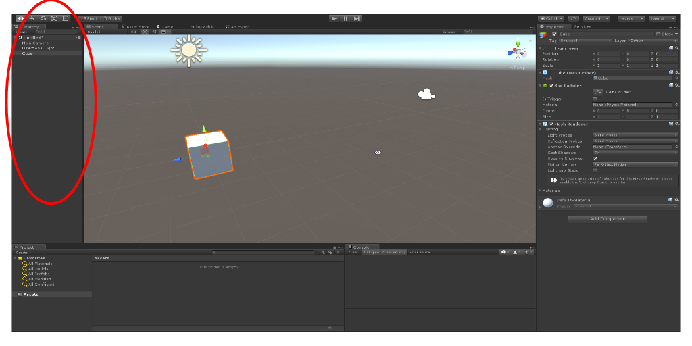
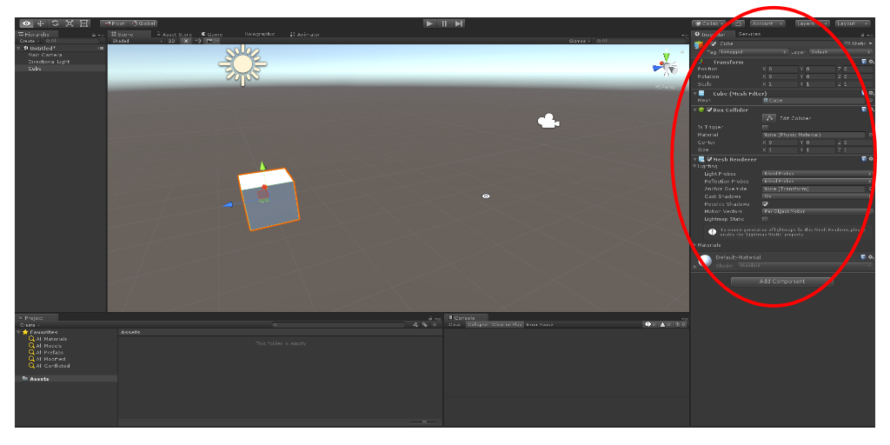
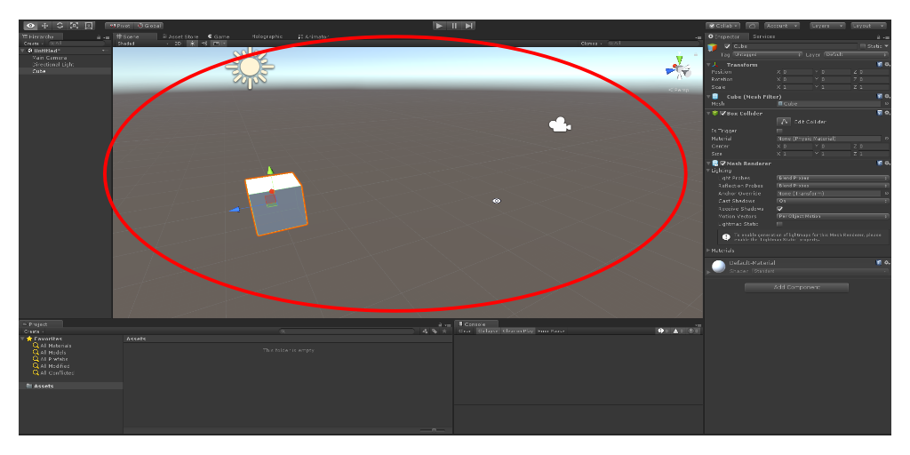
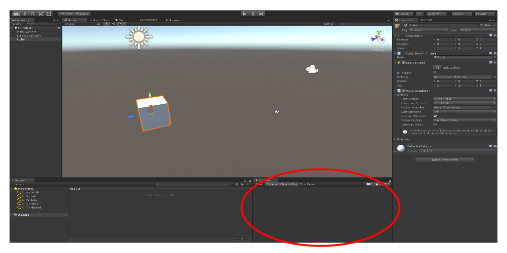
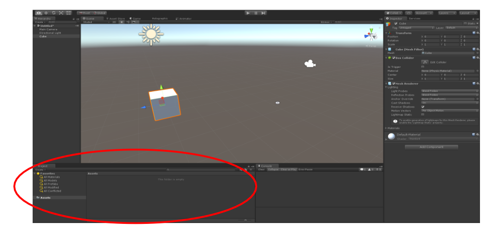

# Welcome to a short Introduction to Unity
The goal of this Document is to help you get acquainted with the Unity interface as it can be a bit overwhelming.
1. [The different Windows](#windows)
    1. [Hierarchy](#hierarchy)
    2. [Inspector](#inspector)
    3. [Scene](#scene)
    4. [Console](#console)
    5. [Project](#project)
2. [Moving around in the scene](#movement)

## Windows
Unity has a variety of windows, all with a different function. The following are the most commonly used windows.
### Hierarchy


This window is where you can find every object in your scene. Here you can select and reorder the object, and you can drop an object into another creating a parent/child relationship.
### Inspector


This window is where you can see the Components of an Object and the Component values. These Components could be the Transform (Location, Rotation, and Scale), Colliders, Materials, Scripts, and so on.

You can use this window to alter the values of the components.
### Scene


The scene window is where you can see the scene you have built. You can directly edit and alter objects in this window using the move, rotate, and scale tools located in the top left corner.
### Console

This window displays and Errors, Warnings, or Debug Messages outputted by your scripts.
To output to this window in your script use the following:
```csharp
Debug.Log("Debug Message, not a warning or error. Can be used for a variety of purposes, like checking variable, ensuring you reach a point in your code, etc.");
Debug.LogWarning("Outputs a warning message. This may signify an error that is not game-breaking, but should be fixed");
Debug.LogError("Outputs an error with this message. Usually signifies a game-breaking bug.");
```

### Project

This window displays the files in your project. This is where you can create and manage your scripts, folders, materials, etc.
The files shown are located in the project's "Assets" folder.

## Movement
Movement in the Scene Window can take some getting use to but is very intuitive.
Hold right-click while preforming the following actions to navigate in the Scene window. Hold right-click + Shift to do the following actions quickly:\
"W": forward\
"S": backward\
"A": left\
"D": right\
"Q": down\
"E": up\
drag mouse: look around\
scroll-wheel-up: move slowly forward\
scroll-wheel-down: move slowly backward\
