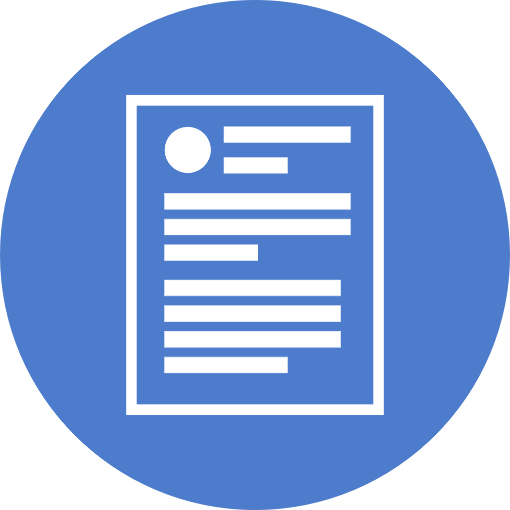

# Hello, I see you need my help.

## Gestures
Gaze - This is the direction where your head is facing, represented by a cursor.\
Tap - This gesture is used to click on objects. This is done by holding up one finger, with your thumb resting across you other fingers, then tapping you thumb with your extended finger.\
Pinch - This is used to drag objects. This is done by making an L with you thumb and forefinger, then pressing the two together. You can then drag an object to the desired location and release it by separating your thumb and forefinger.\
Bloom - This opens the Main menu for the HoloLens. With you palm up and fingers straight, bring all of your fingers together, then spread out your fingers until parallel with your palm.\

For practice (and better explanations), open the "Learn Gestures" app on your HoloLens.

Remember to be very deliberate with your actions.  

## Setting up the needed Demo Information
1. Plug a computer into the router.
2. Open the HoloLens, got to Settings>Network & Internet and connect to the "HoloLensDemo" Network.
3. Wait for it to successfully connect, then open "Advanced Options" in the same menu
4. In the computer, type the IPv4 address of the HoloLens into the browser to access the "Windows Device Portal".
5. Open the app at least once. Hopefully, we will put the latest build on it before you leave.
6. Place the two menus in the location you want them for the presentation.
7. Close the app by clicking on the exit button. If you simply do the “bloom” gesture, the values will not be saved, because the app will still be running in the background.
8. In the Windows Device Portal, select the File Explorer tab.
9.	Go to the following directory to find the DemoInfo text file: LocalAppData\\PrimaryHoloProject_1.0.0.0_x86__pt6n26qfys7q8\\LocalState
10.	Download the existing DemoInfo file and alter the values that you want
    1.	**_Simulate_Product_Data_** should be set to “True” if you do not have access to an instrument
    2.	**_Sharing_IP_** is the IPv4 address of the machine running SharingService.exe. If this is your laptop, input that IP. If SharingService.exe is running on a server, put the server address here.
    3.	**_Product_IP_** is the IPv4 of the device that you want to be displayed on the Gauge Menu. If Simulate_Product_Data is True, you can simply leave this line alone.
11.	Delete the DemoInfo file in the HoloLens (using the web browser)
12.	In “Upload a file to this directory”, click “Choose File”, select the modified DemoInfo file, and click Upload.
13. To show what you are seeing go to the "Mixed Reality Capture" tab in the Windows Device Portal, uncheck "Mic Audio" and "PV Audio", and hit "Live Preview"
14. Expand the player to full screen and broadcast your screen to the projector/display you are presenting from.

### Resizer
This is how you can reposition, rotate, and scale the menus.\
In the upper right hand corner of the menu, there should be a small box with a double sided arrow in the center. If clicked, the resizer box will turn on. The corners (cubes) are used to scale, the spheres are used to rotate, and dragging anywhere else in the box will move.

### Manuals
At any time, you can pull up a manual for the product you are looking at. To do this, click on the manuals Button in the Quick Actions Menu and select the manual you want.\

## Menus
### Selection Menu
This is the menu where you select the product you wish to work with and is divided into 3 sub-menus: Favorites, Categories, and AZ.
##### Favorites Menu
This is the menu that the application will boot to. The menu contains every product the is inside of the application in alphabetical order. We intended to have a system that determines which products you have looked at recently or scan your network for any devices you have and place them first; however, that was never implemented.
##### Category Menu
This menu contains all of the products in the application sorted by the category they are in. Each Product division of the company has a category (CMT, Food Bulk, etc.); however, the products we have in CMT or Food Bulk Packaging.
##### AZ Menu
This menu contains all of the products in the application sorted by the first letter of their name. For example, if A is selected, the Accuscan 6050, AS5012, and AS4012 are displayed.

### Demo Menu
In this menu, you can display a product, display various attachments, and play a short animation.

### Service Menu
In this Menu, you can choose a part to service, step through servicing any part, and toggle visibility on certain parts.

### Sharing
By clicking on the sharing icon in the Quick Actions Menu, you can select a session to join.\
\
If you join with a separate HoloLens, when one person performs an action, the other HoloLens will register that action.
