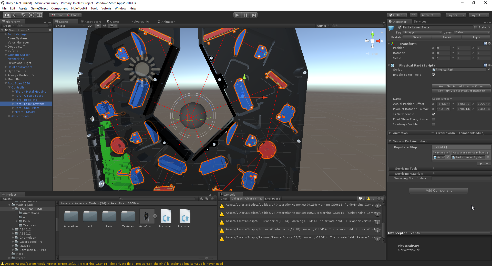

NDC Holographic Assistant
======================

Welcome to the NDC HoloLens Documentation written by Marc Guiselin and Joshua Pyron (JC), the intern programmers who worked on this project!

Click [here](User_Help.md "User Manual") if you are looking for help with using the NDC Holographic Assistant.
It is recommended that you have a basic understanding of working and coding in Unity before looking at this documentation.

1. [Adding Products](#adding-products)
	1. [Model Requirements](#model-requirements)
	2. [Physical Product](#physical-product)
	3. [Physical Part](#physical-part)
	4. [Service Scripts](#service-scripts)
		1. [Custom Remove Animations](#custom-remove-animations)
		2. [Steps](#step-class)
	5. [Adding a Product to the List](#adding-a-product-to-the-list)
2. [Designing a Menu](#designing-a-menu)
	1. [GameObject Structure](#gameobject-structure)
	2. [Menu Structure - Common Menus](#menu-structure---common-menus)
	3. [Menu Structure - Primary Menus](#menu-structure---primary-menus)
	4. [The Resizer](#the-resizer)
	4. [Cursor Modifier](#cursor-modifier)
3. [Classes, Scripts, and Libraries oh my!](#classes-scripts-and-libraries-oh-my)
	1. [MonoBehaviourPlus](#monobehaviourplus)
	2. [Advanced Inspector](#advanced-inspector-asset-store-link)
	3. [DOTween](#dotween-asset-store-link)
	4. [The Datastore](#the-datastore)
	5. [The HP UI Extension Classes](#the-hp-ui-extension-classes)
		1. [HPButton](#hpbutton)
		2. [HPPrettyButton](#hpprettybutton)
		3. [HPQuickActionsButton](#hpquickactionsbutton)
		4. [HPRadioButtonList](#hpradiobuttonlist)
		5. [HPVerticalScrollRect/HPScrollbar](#hpverticalscrollrecthpscrollbar)
	6. [Utilities](#utilities)
	7. [TextMesh Pro](#textmesh-pro-asset-store-link)
	8. [ProBuilder Basic](#probuilder-basic-asset-store-link)
4. [Networked UI Sharing](#networked-ui-sharing)
	1. [Button Press Syncing](#button-press-syncing)
	2. [Creating a new Message Type](#creating-a-new-message-type)
	3. [Sending a Message](#sending-a-message)
	4. [Reading the Received Message](#reading-the-received-message)

5. [Building The Application](#building-the-application)
6. [Misc](#misc)
	1. [High Quality Picture Taking](#high-quality-picture-taking)
	2. [HoloLens Development Setup](#hololens-development-setup)
7. [Recommended Links](#recommended-links)

## Adding Products
We highly suggest that after reading this you take a look at how the "Accuscan 6050" prefab is put together, and try to make your own example product to understand how our part hierarchy and service system work.

#### Model Requirements
  * The Product will be assembled in Unity
  * Each part must be its own model
  * It is recommended that the product's prefab be structured using various empty game objects to sort the parts
  * See the configured Prefabs in the Assets/"Models(3d)"
  * The models must be in one of the following formats:
    * .FBX
    * .DAE (Collada)
    * .3DS
    * .DXF
    * .OBJ
    * .SKP

> **Note:** Keep in mind the product prefab's local rotation and position will be set to 0,0,0 when it is instantiated so it's a good idea to keep your product's prefab rotated and positioned at 0,0,0 on the origin, and use a container object to rotate and center the product.

#### Physical Product
For any new product, start out with an empty GameObject centered on the origin with a rotation of 0,0,0 with a `PhysicalProduct` component added.
###### Service Animation (dropdown)
  If you wish to play animations on a product when it is selected from the selection menu setup your events to trigger that animation to play here.  For example, when the Accuscan is selected and opened up in servicing, it plays an animation that removes the front plate.
###### Demo Animation (variable in demo dropdown)
  If you wish to add an animation that can be played in the demo menu, place it here, for example the Ultrascan plays a small animation of it disassembling and reassembling.
###### Disable When Minimized (variable)
The GameObjects added to this array are disabled unless the product is selected to be serviced or demoed. This increases performance.
###### Selected scale amount (variable)
Used to fine tune the scale of the product when selected.  If left at zero, the product scale will be automatically calculated from its mesh bounds.
###### Selected Start rotation (variable)
The product will rotate to this rotation when selected either in the demo or service menu.  Basically just pick a rotation that looks good.  Try to vary this rotation between different products.

#### Physical Part
Each part and containers of parts must have a Physical Part script in order to appear in the Service menu. Here you must fill out the name, instructions on how to remove the part (for servicing), animations, and the parts that need to be removed before this part (for servicing).

###### Editor Tools

The Physical Parts script has a set of editor tools to help you set up the part's settings. to enable it beck the "enable editor tools" checkbox.  The position handle will help you set the `Actual Position Offset` (sets the position to the object rather than the origin).  And the Rotation handle will help you set the `Product Rotation To Make This Part Visible`(sets the rotation of the product that makes it easy to see the product).  Once you have rotated the product to an angle where the part is very visible, click the `Set Part Visible Product Rotation` button right below the checkbox.  Additionally you can press the `Auto Get Actual Position Offset` to set the `Actual Position Offset` calculated using the average center of the part's mesh bounds.
###### Animation
To animate the removal and replacing of a part as a user goes down the hierarchy of parts,  you should select a `PPAnimationModule` by pressing on the `+` symbol next to `Animation`.  The Transition in animation module will have the part smoothly fade out and move out in one way or fade in move in to its position.  Make sure that all renderers within the part are using materials that are able to fade so they can properly fade in and out.
###### Service Part Animation
In the Remove Steps array, add all of the parts that must be removed before this part, in the order they must be removed. For example, the circuit board on the Accuscan has Bolts at index 0 and the plate at index 1.
In Populate Step, place the animation to be played to remove the part. To do this, click the plus and drag and drop the game object that has the service script into the new event. Then select the animation method from the list (This will be covered further in the [Service Scripts](#service-scripts) section). If you do not wish to develop your own animations for a part, PhysicalProductAnimator has some default basic animations you can choose from.
In Servicing Tools, add to the array and select the tools needed for the job.
In Servicing Materials, add to the array and add the needed materials to replace the part.

#### Attachments
Attachments are addon models to the product that can be viewed in the demo menu.  Create an "Attachments" GameObject in your prefab and put them all in there.  Once you have created your attachment models and placed them in your prefab, go into your prefab's physical product script, open the demo dropdown, and add your attachment to the demo attachments list.  Again look at the Accuscan 6050 model to see how this was done and what settings were used.

#### Service Scripts
  The Service Scripts are used to create animations for each of the parts when they are removed during servicing. To start, create a script (Usually with the name: "ProductNameService") that inherits PhysicalProductAnimator. The Start method is where you designate the products layers (much like an onion has layers, if you want to see part A but it is be hind Part B, create an animation to remove Part B and Show Part A) and should initially look something like the following:
```csharp
  protected override void Start() {
          base.Start();
          physicalProduct.justMovedToThisLayer +=delegate (PhysicalSceneObject THIS, bool down) {
              if (down) { resetProduct(); }//THIS LINE MUST EXIST. It helps reset the product on a few occasions
              else { /*animation to play when moved back up to the top layer*/}
    }  }
```
  When a part is in a new layer, be sure to add an animation for that part formatted like the following:
```csharp
  physicalProduct.parts[0]+=delegate (PhysicalSceneObject THIS, bool down) {
      if (down) { /*animation played when moved down to this layer*/ }
      else { /*animation played when moved back up to this layer*/ }
  }
```
  When down is true, that means that the transition is coming downward from the layer above. For example, the Laserscan's Lens GameObject is below the Laser System, so moving from the Laser System to the Lens would play the animation in the physicalProduct.parts[1].parts[0] down section of the if statement. Moving back to the Laser System will play the animation in the physicalProduct.parts[1] else statement. physicalProduct.justMovedToThisLayer is the highest layer and moving down to the layer is dedicated to resetting the product and its parts to their original positions.
  Also be sure to set the basicMovePosition variable in the Start method. This controls the distance traveled by a part when one of the basic methods are chosen in the remove step section of the Physical Part set up. By default its value is set to 2' however, some products require larger or smaller distances, this is where you can set the value of the basic move.
  **Note:** be sure the first line of the Start method is ``base.Start();``

  See [UltrascanService.cs](Examples/UltrascanService.cs) and [LaserSpeedService.cs](Examples/LaserSpeedService.cs) for Reference.

##### Custom Remove Animations
  Any custom animations for removing specific parts should be placed in its own method in this file. When setting up PhysicalPart, simply select the animation for that part. For example, in [LaserSpeedService.cs](Examples/LaserSpeedService.cs) removing the Housing and Circuitry is preformed by assigning the following method to the remove step of a part:
  ```csharp
  public void removeHousingAndCircuits() {  
  	steps.Add(new Step(new PhysicalPart[] {
  		physicalProduct.parts[2], physicalProduct.parts[3] },
  		HouseCircuit.DOLocalMoveZ(.03f, 1).SetEase(Ease.InOutCubic)
	 ));
  }
  ```

##### Step Class
The step class contains the parts and animations in a step, as well as controlling which animation to play and in what order. When [creating a custom remove animation](#custom-remove-animations), you will need to create a Step object and add it to the list ``steps``.
There are 8 constructors for the Step class, but they are all fairly similar and follow this format:\
``Step(PhysicalPart/*[]*/ part, Tween/*[]*/ animation/*,Vector3 preferredProductRotation/*)``

The default value of "simultaneous" is false. This means that each Tween in the array of animations will be played in the order of the array (0 first, 1 second, etc.). If the value "simultaneous" is set to true, all animations will play together at the same time.
```csharp
Step s = new Step(/*part*/,new Tween[]{/*animation 1/*, /*animation 2/*, /*animation 3*/});
s.simultaneous = true;
steps.Add(s);
```
When simultaneous is true, the Step will loop once the Tween at the end of the array ends. Because of this, it is a good idea to put the longest animation at the end of the array.

#### Adding a Product to the List
  After a Product has been configured and all of the scripts have been added, save the game object as a prefab by dragging the game object to the project window. Then, in the Assets/Resources folder select the DataStore Object. Press the Plus in the Products drop down, provide the requested information, drag in the new prefab, and select whether or not it can be serviced or demoed.

> **Note:**  that this is also the area you can add Tools that the technician can use.

## Designing a Menu
  In Unity designing a menu for the HoloLens is fairly straightforward and requires little additional effort compared to the Standard Unity UIs; however, there are a few things that should be known:

* You should avoid putting a canvas inside of another canvas.
* You can use the Prefabs in the Assets/Prefab/UI folder and copy and paste stuff from the various menus to keep with the theme, style, and interactions we have developed so far.
* UIs should be set to render in world space and scaled to a similar size as to the other menus.
* The workflow that I (Marc, the primary designer and UI programmer) used to design all the menus was to first design it in affinity designer, my graphical design software of choice, and then make it in unity.  You can find these designs in the "prototypes, designs and sketches" folder of the project repo.  I highly recommend using those designs and continuing this workflow. It's also then very easy to export the textures and icons designed right into the project.

### GameObject Structure
* Game Managers (Various GameObjects with only scripts attached to control things like input, voice commands, debug tools, etc)
* HoloLens Camera
* Dynamic UIs (this contains all the important menus.  this GameObject is positioned in front of the camera when the app starts)
  * Gauge Live Data canvas (displays live data from gauge. Currently positioned here for the demo)
  * Container
     * Resizer (A simple prefab for easy resizing of menus. More about that [here](#the-resizer))
     * Common Menus (Contains menus shared by the different menu states)
         * Quick actions menu (Menu with big circular button that always stays to the right of the menu)
         * Black Background (Animated to different positions for each menu)
         * Side Navigation Menu (A side menu on the right. Currently only used by the selection menu)
     * Selection Menu (The menu used for browsing through and selecting a product)
* Always Visible UIs (contains UIs that always remain in view like a loader screen)
   * Fullscreen loader (Used to display app loading is happening)
* Misc UIs (contains all other UIs like the manuals)
* Manuals Container

### Menu Structure - Common Menus
The common menus are simple MonoBehaviours that work on a system of states called modes.  Whenever the primary menu changes, it sets the common menus state to its own.

For example, when the service sub-menu is opened, the action sets the Quick Actions Menu's state to ServiceMenu with: `QuickActionsMenuController.quickActionsMenuMode = QuickActionsMenuMode.ServiceMenu` The state change causes the Quick actions menu to move itself to the correct local position and changes its exit button icon to a back button. From this state pressing that button will change from opening up the close application confirmation window to going back to the selection menu instead.

### Menu Structure - Primary Menus
A menu is menu controller (a class inheriting from MenuController) hiding and showing various sub menus (all classes inheriting from SubMenuController).

#### Selection Menu
Currently the application only has one primary menu: The selection Menu.  The selection menu contains 3 sub menus providing various different ways of finding the product you are looking for. It also contains the Demo sub-menu and the Service sub menu.  The `SelectionMenuSubController` class switches through these and also manages the miniature products below the menu.

### The Resizer
The resizer is a simple prefab that allows easy resizing, rotating, and moving of menus with the HoloLens. Here are the steps to making one work on a new menu:

1. Firstly, position the resizer in the center of what you want to resize.
2. Resize the resizer's `box collider` to encapsulate the whole menu.  Try to keep the `center` vector to 0,0,0 to avoid the resizer box from working unexpectedly.
3. Set the scale of the resizer's child GameObject "Cube" to the same as the collider's `size` value.
4. Move the "stop resizing" button to a good position in front of the menu and right outside of the resizer's `box collider` so it can be pressed.
5. Finally set the variable `hostTransform` in the `ResizerBox` component to its parent GameObject that you are resizing/moving.

And then you should be good.  If you want it to be activated on start just leave the GameObject enabled. If you want to have a script enable it after a button was pressed or something, just have your script call `resizerBox.Show()` and if you just instantiated the menu and want to place it where you are looking with the camera (similar to the manuals) just call `resizerBox.ShowAndPlaceWithCamera()`.

### Cursor Modifier
In the project we have a dynamically changing cursor called "Custom Cursor" that can change appearance depending on what you are looking at.  For example over the resizer rotate spheres, it changes to a rotate object icon.  Cursor modifier scripts can be used to change the look of the cursor and/or make the cursor snap onto a button (Useful for small ones).  Just put a "Cursor Modifier" component on the target object, and tweak the settings.

## Classes, Scripts, and Libraries oh my!

### MonoBehaviourPlus
Most classes should inherit from `MonoBehaviourPlus` which adds a few useful functions and properties like `rectTransform` which returns a `RectTransform`.

### Advanced Inspector ([Asset Store Link](https://www.assetstore.unity3d.com/en/#!/content/18025))
Advanced Inspector is an add-on for unity that expands and improves unity's otherwise lacking default editor.
The asset is used extensively in the project to organize the editor on many of our scripts.  You can get along just fine not using it in your scripts, but the organization it provides will help you in the long term. You can find the documentation for it [here](http://lightstrikersoftware.com/docs/AdvancedInspector_Manual.pdf).

### DOTween ([Asset Store Link](https://www.assetstore.unity3d.com/en/#!/content/18025))
DOTween is a free tweening engine for Unity used extensively in our project for both UI and 3d animations. You can find the documentation for it [here](http://dotween.demigiant.com/documentation.php).

### The Datastore
The DataStore is a ScriptableObject that holds a variety of settings and references to objects.  
#### Laser Settings
Various different settings used by the RealtimeLaserEmmiters
#### Products
An array of products.  This is where you add new products that will then appear in the selection menu.

* Name - The name of the product
* Model Name - The name of the model
* Category - From what product category is this product from
* Model - A reference to the product's model prefab
* Can Service - Can this part be opened in the service menu?
* Can Demo - Can this part be opened in the service menu?
* Related Manuals - When this part is selected, these are a list of the manuals that can be opened with it
* Description - A big block of text to describe the product in the favorites menu


### The HP UI Extension Classes
These are a set of classes that are modifications of the default unity UI scripts to suit my(Marc) vision of the UI better.
#### HPButton
The `HPButton` inherits from the `Selectable` class with the ability to be clicked by both HoloLens and mouse input and trigger an [action delegate](https://msdn.microsoft.com/en-us/library/system.action(v=vs.110).aspx) called `onTrigger`.
#### HPPrettyButton
The `HPPrettyButton` class inherits from `HPButton` and is used in the pretty button prefabs.  The prefab for these buttons is called "HPButton - Text" and can be found in the prefabs folder.
#### HPQuickActionsButton
The `HPQuickActionsButton` class inherits from `HPButton` and is used to make the `QuickActionsMenu'`s circular buttons work.
#### HPRadioButtonList
A simple implementation of radio buttons. Put this script onto a parent of multiple `HPPrettyButton`s and when a button is clicked, the old selected button will be unclicked and the `HPRadioButtonList` will trigger an [action delegate](https://msdn.microsoft.com/en-us/library/system.action(v=vs.110).aspx) with a reference to the new button that was just clicked, though its probably a better idea to append event to all the buttons separately and let the `HPRadioButtonList` handle the selecting of buttons and unselecting of old ones.
> **Note:** If you need an example of how this is used you can look at the a-z list menu's a-z buttons
#### HPVerticalScrollRect/HPScrollbar
These two classes are used together to make vertically scrollable containers with stuff inside them easily controlled by both the mouse and the hololens.  
> **Note:** If you need an example of how this is used you can look at the "HPScrollRect - Center Text" GameObject and children in the favorites sub-menu

### Utilities
The utilities class is just a big class containing a massive array of useful methods from around the internet.

### TextMesh Pro ([Asset Store Link](https://www.assetstore.unity3d.com/en/#!/content/84126))
TextMesh Pro is an asset I decided to use instead of unity's bare and often blurry-looking Text displaying options.  Every Piece of text is displayed using TextMesh Pro.  The font we are using for the entire project is Century Gothic with 1 exception (The Quick actions Menu buttons).  I care a lot about typography.  So if you mess it up anywhere in the project, wherever you are, I will find you and you won't be having a nice day.  - Marc :)

### ProBuilder Basic ([Asset Store Link](https://www.assetstore.unity3d.com/en/#!/content/11919))
ProBuilder Basic is a mesh creation utility in unity.  It was used a bit everywhere especially to create surfaces on models.

## Networked UI Sharing
Being able to share Holograms, whether in the same room or across the country, is a very interesting part of the HoloLens.  This section will concentrate on creating, sending, and receiving messages with the system we currently have set in place.

We followed the documentation for implementing the legacy sharing system, so be aware that we are not using UNet.  If you plan on recreating the sharing system we recommend you use UNet.

The general concept of connecting HoloLenses relies on sending and receiving  messages. In the HoloLens, whenever a button is pressed or an model is rotated, the system sends a message to the server, which is then distributed to all of the other HoloLenses. When the message is received, each system used the information in the message to alter its own environment.  For example, if you pressed a button, the HoloLens would send a message to tell the others about the button being pressed, which would then be processed by the HoloLens pressing the same button.

#### Button Press Syncing
When you are connected to a session, by default, all buttons will sync their presses.  When a button is pressed on one client, it sends a message to all other clients with a string indicating the position of the button in the hierarchy.  If you don't want a button to sync, just uncheck the `Networked Button` variable in any of the HPButton classes

#### Creating a new Message Type
If you are planning to sync a new value or set of values between shared clients, you must add a new messagetype to the `SharedMessageType` enum in `NetworkController.cs`

> **NOTE:** Add the enum between `SharedMessageType.First` and `SharedMessageType.Last` otherwise it won't work!

#### Sending a Message
Next to send the message when the user provides input of a value changes, you can use our `SimpleNetworkSender` class to easily create and send a message.
When you are done writing stuff on the message you can send it with one of two ways: `SendReliably()` or `SendFast()`.  Use `SendReliably()` if this message was a one time thing that all other receivers absolutely need to receive and use `SendFast()` if we are updating something like the rotation of an object very quickly and its okay if some of the messages don't get to all receivers.

Here's an example sending many different data types:
```csharp
var msg = new SimpleNetworkSender(SharedMessageType.MyMessageType);

msg.WriteString("Something awesome totally just happened!");
msg.WriteInt(42);
msg.WriteVector3(Vector3.one * 9000);

if(sendReliably)
	msg.SendReliably();
else
	msg.SendFast();
```

#### Reading the Received Message
Next to do something when the message is received, you must add a case to the switch statement in the `OnMessageRecieved` function in the `NetworkController` class.  To decode the received message you must read the message in the same order it was written (So if an int, then a string were sent, then you must read the int first and then the string).

## Building The Application
Once you have something you wish to build, the steps are fairly straight forward. Be sure that you have [setup the HoloLens for development.](#hololens-development-setup)\
**Note:** If you have already built the app once, follow steps 10,11, and 16.
1. In the upper-left corner of Unity, select Edit>Project Settings>Quality
2. In the Inspector, click on the drop down under the Windows Store icon and select "Fastest"
3. In the upper-left corner of Unity, select File> Build Settings...
4. Select "Windows Store" and press the "Switch Platform" button.
5. Click on the "Add Open Scenes" button
6. Ensure "Unity C# Projects" is checked
7. Click on the "Player Settings..." button
8. In the Publishing Settings Section, make sure that the needed capabilities are selected (For the NDC HoloLens Experience, these are "InternetClient, PrivateNetworkClientServer, SpatialPerception, WebCam, and Microphone)
9. In the Other Settings Section, check "Virtual Reality Supported", and make sure that "Windows Holographic" is in the "Virtual Reality SDKs" list
10. Finally in the File>Build Settings.. menu, click on the Build button, and select the App folder(create it if you do not see it)
11. When complete, a window will open to the App folder. Open the generated SLN.
12. In the dropdowns at the top of the window, select Release and x86
13. If the HoloLens is connected to your computer with a cable, select "Local Machine" in the dropdown next to play button and skip step 14. If not, select "Remote Machine".
14. In your HoloLens, go to Settings>Network & Internet>Advanced Options and input your IPv4 address into the window that appeared in Visual Studio.
	1. If no window appeared, right-click your project in the Solution Explorer, select Properties, and go to the Debug tab. Input the IPv4 address into the field "Remote machine".
15. At this point, Visual Studio should be asking for a pin. In you HoloLens, go to Settings>Update & Security>For Developers>Paired Devices and click on the "Pair" button. Input the pin into Visual Studio. **NOTE:** DO NOT CLOSE THE DISPLAY SHOWING YOUR PIN UNTIL YOU HAVE FULLY CONNECTED.
16. Finally, hit the play button and Visual Studio should install your app onto your HoloLens.


If you wish to change the IP address of your device, follow Step 14i.

## Misc
### High Quality Picture Taking
The terrible HoloLens camera and low-resolution screen mean that screenshots taken with the HoloLens are pretty awful.

1. Take some pictures with a camera or phone of where you want the app to be overlaid over.
2. Play the app and maximize the game window in unity.  Keep an inspector window open and locked onto the HoloLensCamera GameObject.
2. Get the app to the state you want and fly around to a good position for a shot.  Keep in mind the angle you took your picture at.  You want it to look like the menu is upright.
3. On the "Transparency Capture To File" component on the camera press the Take Screenshot button and specify a good save location
4. Finally open up the real picture and the screenshot together in a photo editing program and rotate, scale, crop, and do whatever you have to do to make it look good.  Then export.

> **Note:** The Screenshot size will depend on the size of the Game window when the screenshot is taken, so that's why I suggest you maximize it

### HoloLens Development Setup
In your HoloLens, go to Settings>Update & Security>For Developers. Turn on Developer Mode and Device Portal.

## Recommended Links
[Easings.net](http://easings.net/) - For easy viewing of different ease functions
